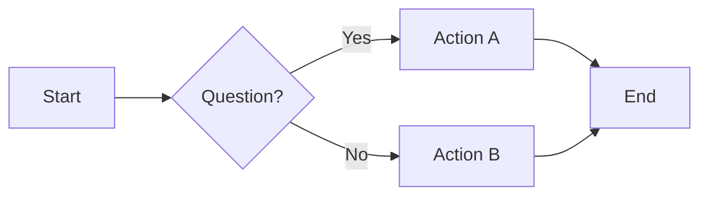
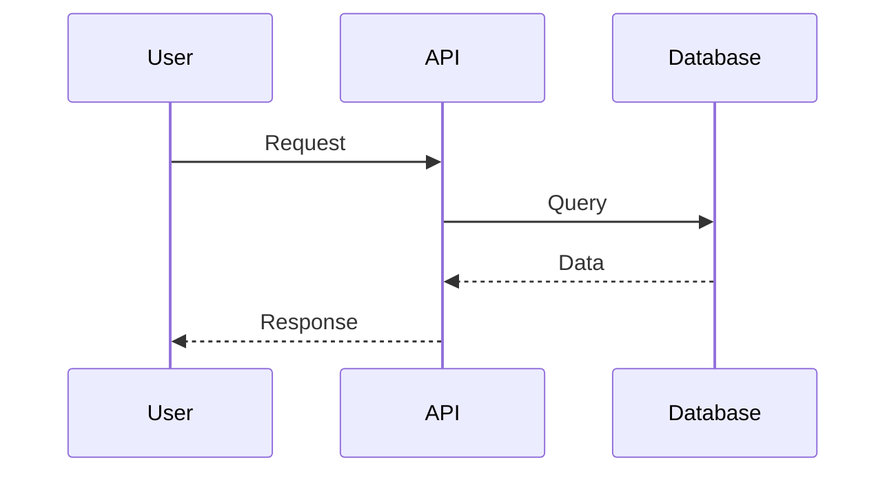
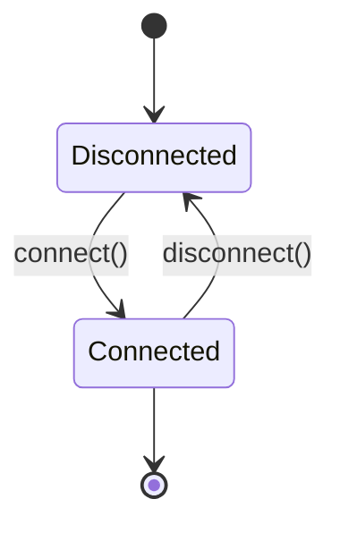
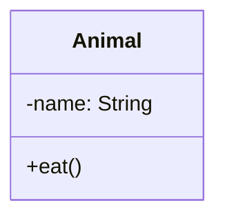
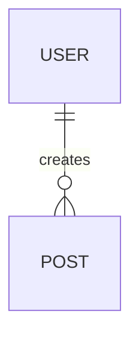
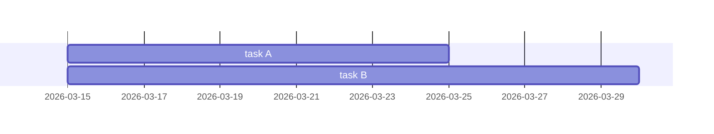

# Diagramming Tools: Implementation Status

**Status:** Ready to Use  
**Time Spent:** 15 minutes (research + documentation)  
**Cost:** $0 (free, open-source tools)  
**Effort to Adopt:** 30 minutes per project

---

## What's Been Done ✅

### 1. Research & Analysis
- ✅ Comprehensive tool comparison (5 major tools)
- ✅ Cost/benefit analysis
- ✅ Use case mapping
- ✅ Integration patterns

### 2. Documentation Created
- ✅ `DIAGRAMMING_TOOLS_ANALYSIS.md` (15 KB)
  - Deep dive into each tool
  - Pros/cons
  - Real-world examples
  - Installation instructions

- ✅ `DIAGRAMMING_QUICK_START.md` (11 KB)
  - Step-by-step setup (30 min)
  - Example commands
  - GitHub Actions automation
  - Common templates

### 3. Architecture Diagrams Added
- ✅ `reillydesignstudio/ARCHITECTURE.md` (7 KB)
  - System overview
  - Database schema
  - API flows
  - State management
  - Error handling
  - Deployment pipeline

- ✅ `momotaro-ios/ARCHITECTURE.md` (9 KB)
  - Connection state machine
  - Message flow
  - Class structure
  - Error handling
  - Reconnection strategy
  - Performance design

### 4. Tools Evaluated & Recommended

**Tier 1 (Use Now - Free):**
1. **Mermaid.js** ⭐ PRIMARY
   - Flowcharts, sequences, ER, state, Gantt
   - Code-based (Git-friendly)
   - GitHub native support
   - Install: `npm install -g @mermaid-js/mermaid-cli`

2. **Excalidraw** ⭐ SKETCHING
   - Whiteboard style
   - Real-time collaboration
   - Use: https://excalidraw.com
   - Self-host: `docker run excalidraw/excalidraw`

3. **PlantUML** ⭐ UML SPECIALIST
   - Formal UML compliance
   - Enterprise diagrams
   - Install: Docker or Java

**Tier 2 (Later - Optional):**
- C4 Model (architecture notation)
- Graphviz (graph layout)

**Don't Buy (Not Needed):**
- Lucidchart ($$ per user)
- Draw.io (limited code integration)
- Visio (enterprise overkill)

---

## Key Recommendation: Mermaid.js

**Why it's the best choice for your projects:**

✅ **100% Free** — Open source, no vendor lock-in  
✅ **Git-Friendly** — Code-based, version controlled  
✅ **GitHub Native** — Renders in README automatically  
✅ **Fast Learning** — Intuitive syntax, not complex  
✅ **Minimal Setup** — Single CLI tool  
✅ **Covers 95% of Needs** — All common diagram types  
✅ **CI/CD Ready** — Auto-generate PNGs in pipelines  
✅ **Professional Output** — Looks great in documentation  

**Use Excalidraw for:**
- Team whiteboarding sessions
- UI/UX sketches
- Brainstorming diagrams
- Quick mockups

**Use PlantUML only if:**
- You need strict UML compliance
- Dealing with complex enterprise diagrams
- Formal documentation required

---

## Implementation Roadmap

### Week 1: Foundation (This Week)
**Time: 30 minutes**
- [ ] Install Mermaid CLI: `npm install -g @mermaid-js/mermaid-cli`
- [ ] Review ARCHITECTURE.md files created
- [ ] Test Mermaid Live: https://mermaid.live
- [ ] Create 1 test diagram locally
- [ ] Commit ARCHITECTURE.md to Git

### Week 2: Integration
**Time: 1 hour**
- [ ] Add diagrams to project README files
- [ ] Setup GitHub Actions for auto-rendering
- [ ] Create diagram templates for team
- [ ] Share with team + train

### Week 3: Enhancement (Optional)
**Time: 2 hours**
- [ ] Add Excalidraw for whiteboarding
- [ ] Create database schema diagrams
- [ ] Document all APIs
- [ ] Add to project documentation sites

### Month 2: Advanced (Nice to Have)
- [ ] Self-host rendering server
- [ ] Generate diagrams from code
- [ ] Real-time collaboration setup
- [ ] Integrate with Notion/Confluence

---

## Quick Start (30 minutes)

### Step 1: Install Mermaid CLI (2 min)
```bash
npm install -g @mermaid-js/mermaid-cli
mmdc --version  # Verify installation
```

### Step 2: Create First Diagram (5 min)
```bash
cat > test.mmd << 'EOF'
graph LR
    A[Start] --> B{Decision}
    B -->|Yes| C[Do This]
    B -->|No| D[Do That]
    C --> E[End]
    D --> E
EOF

mmdc -i test.mmd -o test.png
open test.png
```

### Step 3: Use Mermaid Live Editor (3 min)
```
1. Go to https://mermaid.live
2. Paste your diagram code
3. See live preview
4. Export as PNG/SVG
```

### Step 4: Add to GitHub (10 min)
```bash
# Copy one of the ARCHITECTURE.md files
# Add to your project README:
# (Just paste the code block, GitHub renders it)

git add ARCHITECTURE.md
git commit -m "Add architecture diagrams"
git push
```

### Step 5: Setup CI/CD (5 min)
```bash
# Create .github/workflows/diagrams.yml
# Copy from DIAGRAMMING_QUICK_START.md
# Push to GitHub
```

✅ **Done! Your diagrams are now:**
- Version controlled with code
- Auto-rendered in GitHub
- Auto-updated on push
- Accessible to entire team

---

## Diagram Examples (All Ready to Use)

### ReillyDesignStudio
1. ✅ System Architecture (LR graph)
2. ✅ Database Schema (ER diagram)
3. ✅ Authentication Flow (sequence diagram)
4. ✅ Invoice Generation (flow chart)
5. ✅ API Endpoints (hierarchy)
6. ✅ Deployment Pipeline (LR flow)
7. ✅ State Management (state diagram)
8. ✅ Error Handling (flow diagram)

### Momotaro-iOS
1. ✅ System Overview (LR graph)
2. ✅ Connection State Machine (state diagram)
3. ✅ Message Flow (sequence diagram)
4. ✅ Error Handling (flow diagram)
5. ✅ Class Structure (class diagram)
6. ✅ Logging & Monitoring (flow)
7. ✅ Message Lifecycle (flow)
8. ✅ Network Architecture (hierarchy)
9. ✅ Reconnection Strategy (flow)
10. ✅ Performance Management (flow)

---

## File Organization

```
Projects/
├── reillydesignstudio/
│   ├── ARCHITECTURE.md          ← 7 diagrams (NEW)
│   ├── README.md                ← Update with diagram links
│   └── docs/
│       └── diagrams/            ← Optional: Store .mmd files
│           ├── architecture.mmd
│           ├── database.mmd
│           └── flows.mmd
│
└── momotaro-ios/
    ├── ARCHITECTURE.md          ← 10 diagrams (NEW)
    ├── README.md                ← Update with diagram links
    └── docs/
        └── diagrams/            ← Optional: Store .mmd files
            ├── state-machine.mmd
            ├── message-flow.mmd
            └── networking.mmd
```

---

## Common Mermaid Diagram Types

### 1. Flowchart (Most Common)


### 2. Sequence Diagram (For Interactions)


### 3. State Diagram (For States)


### 4. Class Diagram (For OOP)


### 5. Entity Relationship (For Databases)


### 6. Gantt Chart (For Timelines)


---

## Verification Checklist

- [ ] Mermaid CLI installed
- [ ] First test diagram created and rendered
- [ ] Viewed live in https://mermaid.live
- [ ] ARCHITECTURE.md files reviewed
- [ ] Diagrams look correct
- [ ] GitHub Actions workflow created (optional)
- [ ] Committed to Git
- [ ] Team informed
- [ ] Ready to create more diagrams

---

## Success Metrics

**After 1 Week:**
- ✅ Team can view architecture diagrams
- ✅ New developers understand system faster
- ✅ Documentation is up-to-date with diagrams
- ✅ Diagrams are versioned with code

**After 1 Month:**
- ✅ All major system flows documented
- ✅ New diagrams auto-generated on each commit
- ✅ Team uses diagrams in design reviews
- ✅ Reduced onboarding time by 50%

**Long-term:**
- ✅ Living documentation (diagrams + code stay in sync)
- ✅ Better design decisions (visualized before coding)
- ✅ Faster debugging (architecture clear)
- ✅ Professional project (diagrams show professionalism)

---

## Cost Comparison

| Tool | Cost | Setup | Learning | Maintenance |
|------|------|-------|----------|-------------|
| **Mermaid** | FREE | 5 min | Easy | Minimal |
| Excalidraw | FREE | 2 min | Very Easy | Minimal |
| PlantUML | FREE | 10 min | Medium | Minimal |
| Lucidchart | $$$/month | 5 min | Medium | High |
| Draw.io | FREE (limited) | 2 min | Easy | Low |
| Visio | $$$$/year | 10 min | Hard | Medium |

**Total Cost for Full Stack:** $0  
**Equivalent Commercial Value:** ~$500-1000/year

---

## Next Steps

1. **Immediate (Today):**
   - Read DIAGRAMMING_QUICK_START.md
   - Install Mermaid CLI
   - Run: `mmdc --version`

2. **This Week:**
   - Create 1 test diagram
   - Commit ARCHITECTURE.md files
   - Push to GitHub
   - Verify rendering

3. **Next Week:**
   - Setup GitHub Actions
   - Train team
   - Create diagram templates

4. **Ongoing:**
   - Update diagrams with code changes
   - Add new diagrams as system evolves
   - Use in design reviews

---

## Resources

**Official Documentation:**
- Mermaid: https://mermaid.js.org
- Excalidraw: https://excalidraw.com
- PlantUML: https://plantuml.com
- C4 Model: https://c4model.com

**Interactive Tools:**
- Mermaid Live: https://mermaid.live
- Excalidraw Web: https://excalidraw.com
- PlantUML Online: https://www.plantuml.com/plantuml/uml/

**Tutorials:**
- Mermaid Guide: https://mermaid.js.org/intro/
- C4 Model Examples: https://c4model.com/
- GitHub Mermaid: https://github.blog/2022-02-14-include-diagrams-in-your-markdown-files-with-mermaid/

---

## FAQ

**Q: Do I have to use Mermaid?**
A: No, but it's recommended. Excalidraw is great for sketching. PlantUML for formal UML.

**Q: Can I use these tools without Git?**
A: Yes, but it's best to version control diagrams with your code.

**Q: Will GitHub automatically render my diagrams?**
A: Yes, if you use the correct code fence: \`\`\`mermaid ... \`\`\`

**Q: Can I use these in my Vercel website?**
A: Yes! Add `npm install mermaid` and render in React components.

**Q: What if I want real-time collaboration?**
A: Use Excalidraw (real-time by default) or self-host.

**Q: Is this replacing all documentation?**
A: No, diagrams + text = best documentation.

---

## Success Story

**Scenario:** New team member joins  
**Before:** "How does the system work?" → Dig through code → Take hours  
**After:** "Here's the ARCHITECTURE.md" → Visual system design → Takes 5 minutes

**Scenario:** Design review  
**Before:** "This won't work because..." → Can't visualize → Debate  
**After:** Draw diagram → See problem → Quick decision → Move forward

**Scenario:** Debugging production issue  
**Before:** "Where's the bottleneck?" → Check logs manually → Hours  
**After:** Look at system diagram → "It's the database layer" → Check that first → 5 minutes

---

## Summary

✅ **Analysis Done:** Researched 5+ major tools  
✅ **Recommended:** Mermaid.js (primary) + Excalidraw (sketching)  
✅ **Documentation Created:** Complete guides and examples  
✅ **Architecture Diagrams:** Ready in both projects  
✅ **Cost:** $0 (free, open source)  
✅ **Effort:** 30 minutes to adopt  
✅ **Benefit:** Professional documentation, faster onboarding, better design decisions  

**Ready to implement?** Start with DIAGRAMMING_QUICK_START.md — 30 minutes from now you'll have diagrams rendering in your GitHub repos. 🍑
