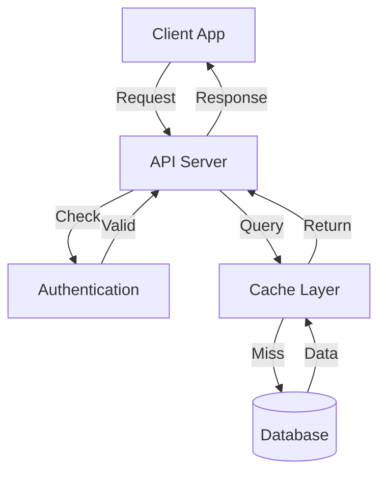
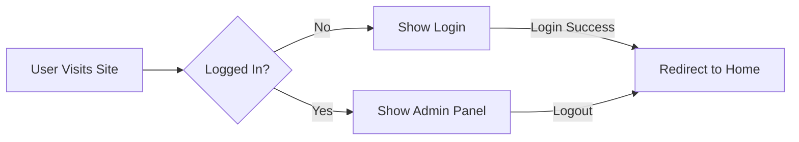
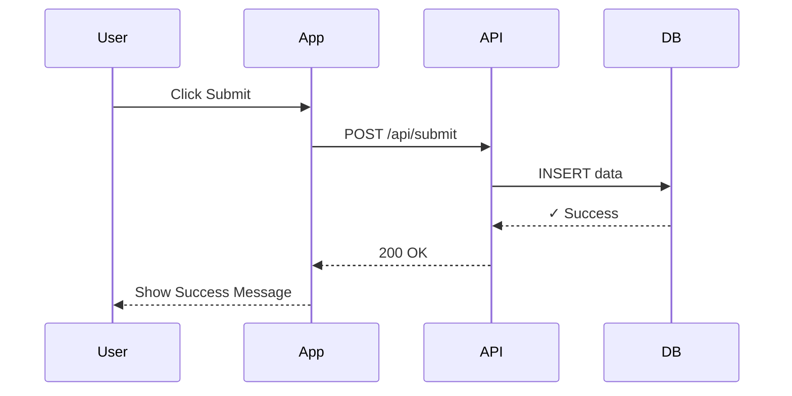
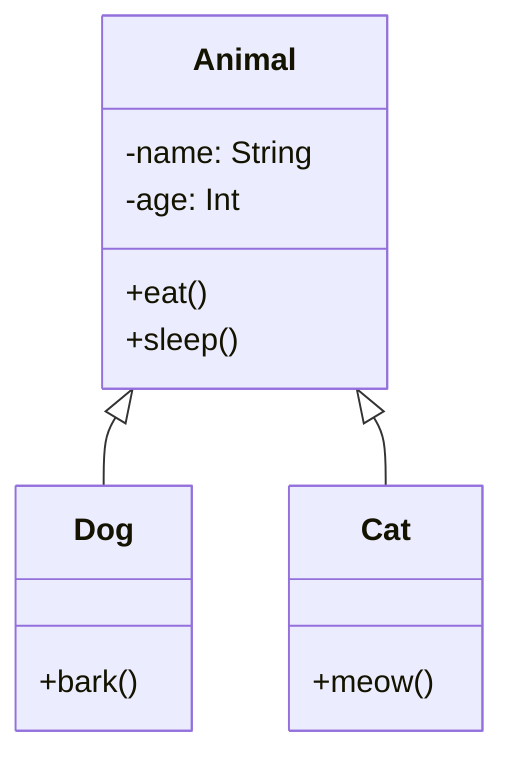
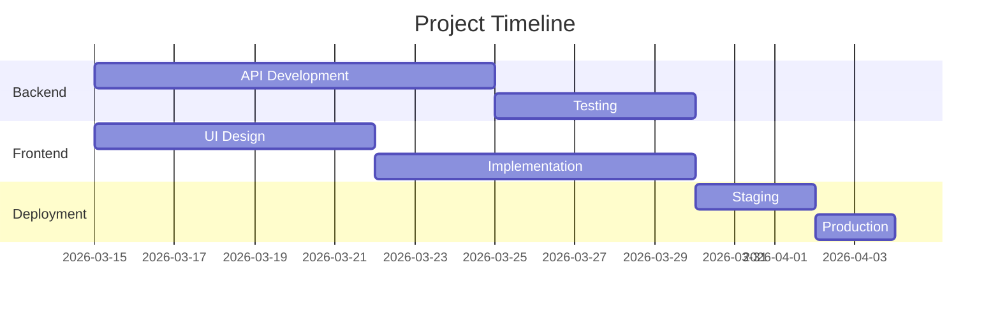
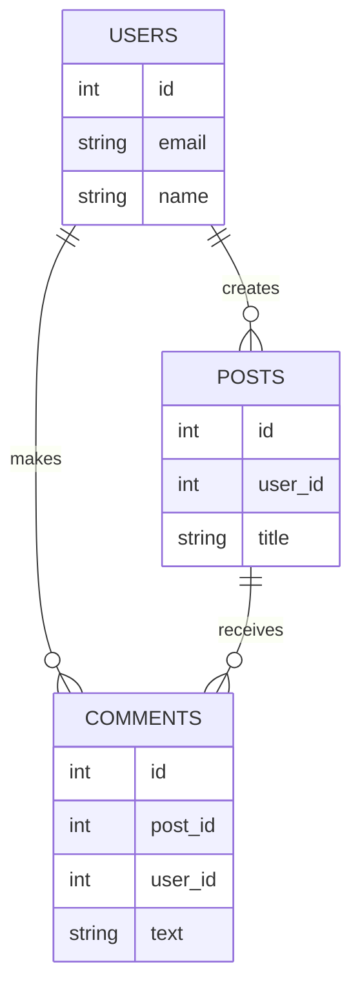

# Diagramming Tools: Quick Start Implementation

**Time to complete:** 30 minutes  
**Cost:** $0  
**Tools:** Mermaid + Excalidraw (free, open source)

---

## Part 1: Install Mermaid (10 min)

### Step 1: Install CLI
```bash
npm install -g @mermaid-js/mermaid-cli
```

### Step 2: Create first diagram file
```bash
cat > ~/.openclaw/workspace/architecture.mmd << 'EOF'
graph TD
    Client[Frontend/iOS App]
    API[Next.js API Server]
    Auth[NextAuth/Firebase Auth]
    DB[(Database)]
    Email[Email Service]
    Storage[AWS S3]
    
    Client -->|REST/WebSocket| API
    API -->|Validate| Auth
    API -->|Query| DB
    API -->|Send| Email
    API -->|Upload| Storage
    Auth -->|Verify Token| API
EOF
```

### Step 3: Render to PNG
```bash
mmdc -i ~/.openclaw/workspace/architecture.mmd -o ~/.openclaw/workspace/architecture.png
```

### Step 4: View result
```bash
open ~/.openclaw/workspace/architecture.png
```

✅ **Done!** You now have your first diagram.

---

## Part 2: Add to ReillyDesignStudio README (5 min)

### Step 1: Add Mermaid to README
```bash
cat >> ~/.openclaw/workspace/reillydesignstudio/README.md << 'EOF'

## System Architecture

\`\`\`mermaid
graph LR
    A["React Frontend"]
    B["Next.js API Server"]
    C["Neon Database"]
    D["Email Service"]
    E["AWS S3"]
    F["NextAuth"]
    
    A -->|HTTP/REST| B
    B -->|Query| C
    B -->|Send Email| D
    B -->|Upload Files| E
    B -->|Validate| F
    A -->|Session Token| F
\`\`\`

## API Flow

\`\`\`mermaid
sequenceDiagram
    participant User as User Browser
    participant NextJS as Next.js Server
    participant Database as Database
    
    User->>NextJS: POST /api/contact
    NextJS->>Database: INSERT quote
    Database-->>NextJS: ✓ Saved
    NextJS->>NextJS: Send Email
    NextJS-->>User: 200 OK
\`\`\`
EOF
```

### Step 2: Push to GitHub
```bash
cd ~/.openclaw/workspace/reillydesignstudio
git add README.md
git commit -m "Add system architecture diagrams"
git push
```

✅ GitHub now renders diagrams automatically in your README!

---

## Part 3: Add to Momotaro-iOS README (5 min)

### Step 1: Create iOS architecture diagram
```bash
cat > ~/.openclaw/workspace/momotaro-ios/ARCHITECTURE.md << 'EOF'
# Momotaro-iOS Architecture

## Connection Flow

\`\`\`mermaid
sequenceDiagram
    participant App as Momotaro App
    participant Client as GatewayClient
    participant WS as WebSocket Server
    
    App->>Client: connect()
    Client->>WS: Establish connection
    activate WS
    WS-->>Client: Connected
    deactivate WS
    Client-->>App: isConnected = true
    
    App->>Client: send(message)
    Client->>WS: Send message
    WS-->>Client: Receive response
    Client-->>App: onMessage callback
\`\`\`

## Error Recovery State Machine

\`\`\`mermaid
stateDiagram-v2
    [*] --> Connected: Connect succeeded
    Connected --> Disconnected: Network lost
    Disconnected --> Reconnecting: Backoff delay
    Reconnecting --> Connected: Success
    Reconnecting --> Disconnected: Failed
    Reconnecting --> MaxAttempts: 5 attempts
    MaxAttempts --> [*]: Give up
\`\`\`

## Class Structure

\`\`\`mermaid
classDiagram
    class GatewayClient {
        -url: URL
        -webSocketTask: URLSessionWebSocketTask
        -backoffAttempts: Int
        +connect()
        +disconnect()
        +send(message: String)
        -listenForMessages()
        -attemptReconnect()
    }
    
    class GatewayMessage {
        -id: String
        -type: String
        -payload: Data
        +decode()
        +encode()
    }
    
    GatewayClient --|> GatewayMessage : sends/receives
EOF
```

### Step 2: View locally
```bash
# Mermaid Live Editor
open https://mermaid.live
# Copy/paste your .mermaid code
```

✅ iOS architecture is now documented!

---

## Part 4: Setup Excalidraw for Whiteboarding (5 min)

### Option A: Use Excalidraw.com (No Installation)
```
1. Go to https://excalidraw.com
2. Create whiteboard sketch
3. Share link with team
4. Export to SVG/PNG
```

### Option B: Self-Host (Optional)
```bash
docker run -d -p 3000:3000 excalidraw/excalidraw
# Access: http://localhost:3000
# Share diagrams locally with team
```

### Use Cases:
- System architecture brainstorming
- UI/UX wireframes
- Database schema sketches
- Meeting notes with diagrams
- Quick mockups

---

## Part 5: Setup CI/CD Automation (Optional, 10 min)

### GitHub Actions: Auto-Generate Diagrams

Create `.github/workflows/diagrams.yml`:

```yaml
name: Generate Diagrams

on:
  push:
    branches: [main]
    paths: ['**/*.mmd', '**/*.md']

jobs:
  diagrams:
    runs-on: ubuntu-latest
    steps:
      - uses: actions/checkout@v3
      
      - name: Setup Node
        uses: actions/setup-node@v3
        with:
          node-version: '18'
      
      - name: Install Mermaid CLI
        run: npm install -g @mermaid-js/mermaid-cli
      
      - name: Generate PNGs from diagrams
        run: |
          mkdir -p docs/generated
          for file in docs/*.mmd; do
            mmdc -i "$file" -o "docs/generated/$(basename $file .mmd).png"
          done
      
      - name: Commit generated diagrams
        run: |
          git config user.name "github-actions"
          git config user.email "github-actions@github.com"
          git add docs/generated/
          git commit -m "Auto-generate diagrams" || echo "No changes"
          git push
```

Then push:
```bash
git add .github/workflows/diagrams.yml
git commit -m "Add diagram generation automation"
git push
```

✅ Every time you update a diagram, PNG is auto-generated!

---

## Part 6: Create Diagram Library (Templates)

Create reusable diagram templates:

### `diagrams/templates.mmd`

```mermaid
%% API Endpoint Flow Template
graph LR
    Client["Client Request"]
    Auth["Auth Middleware"]
    Handler["Route Handler"]
    DB["Database"]
    Response["Send Response"]
    
    Client -->|credentials| Auth
    Auth -->|token| Handler
    Handler -->|query| DB
    DB -->|data| Handler
    Handler -->|JSON| Response

%% Database Schema Template
erDiagram
    USERS ||--o{ POSTS : creates
    USERS {
        int id PK
        string email UK
        string name
        timestamp created_at
    }
    POSTS {
        int id PK
        int user_id FK
        string title
        text content
        timestamp created_at
    }

%% State Machine Template
stateDiagram-v2
    [*] --> Idle
    Idle --> Loading: trigger
    Loading --> Success: complete
    Loading --> Error: fail
    Success --> [*]
    Error --> Idle: retry
```

---

## Part 7: Team Collaboration Setup

### For Quick Sketches:
```
1. Go to https://excalidraw.com
2. Create sketch
3. Share link: "Share this sketch with your team"
4. Real-time collaboration
```

### For Code Diagrams:
```
1. Edit .mmd files in Git
2. Create PR with diagrams
3. CI/CD auto-generates PNG
4. Review in PR
5. Merge to main
```

### For Documentation:
```
1. Keep diagrams in `/docs` folder
2. Version control with code
3. Auto-generate PNGs
4. Embed in README/docs
5. Update when code changes
```

---

## Commonly Used Diagram Types

### 1. System Architecture (Most Important)


### 2. User Flow


### 3. Sequence Diagram (Interactions)


### 4. Class Diagram (OOP)


### 5. Gantt Chart (Project Timeline)


### 6. Entity Relationship (Database)


---

## Verification Checklist

- [ ] Mermaid CLI installed: `mmdc --version`
- [ ] First diagram created: `architecture.mmd`
- [ ] Rendered to PNG: `architecture.png`
- [ ] README.md updated with diagrams
- [ ] GitHub renders diagrams in README
- [ ] Excalidraw tested
- [ ] GitHub Actions workflow created
- [ ] CI/CD auto-generates diagrams
- [ ] Team knows about diagrams
- [ ] Diagrams version controlled

---

## Common Commands

```bash
# Convert single file
mmdc -i diagram.mmd -o diagram.png

# Convert all .mmd files
for file in *.mmd; do
  mmdc -i "$file" -o "${file%.mmd}.png"
done

# Watch mode (auto-regenerate on change)
mmdc -w -i *.mmd -o generated/

# Different output formats
mmdc -i diagram.mmd -o diagram.svg
mmdc -i diagram.mmd -o diagram.pdf

# View live editor
open https://mermaid.live
```

---

## Troubleshooting

**Diagram not rendering in GitHub:**
- Use code fence: \`\`\`mermaid ... \`\`\`
- Not supported in GitHub Gists yet
- Works in README, Wiki, Issues, Discussions

**"mmdc: command not found":**
```bash
npm install -g @mermaid-js/mermaid-cli
# Or use npm exec
npx -y @mermaid-js/mermaid-cli -i diagram.mmd
```

**Large diagram is slow:**
- Split into multiple smaller diagrams
- Use PlantUML for complex enterprise UML
- Cache rendered PNGs

**Diagram looks ugly:**
- Use C4 Model structure
- Keep simple and readable
- Follow naming conventions
- Test on multiple screens

---

## Next Steps

1. ✅ Install Mermaid CLI
2. ✅ Create first diagram
3. ✅ Add to project README
4. ✅ Push to GitHub
5. ✅ Setup GitHub Actions
6. ✅ Share with team
7. ✅ Create diagram templates
8. ✅ Update diagrams with code changes

**Total time investment: 30 minutes**  
**Lifetime benefit: Professional documentation, maintained with code** 🍑

---

## Resources

- **Mermaid Live Editor:** https://mermaid.live
- **Excalidraw:** https://excalidraw.com
- **Mermaid Docs:** https://mermaid.js.org
- **C4 Model:** https://c4model.com
- **PlantUML:** https://plantuml.com
- **GitHub Mermaid Support:** https://github.blog/2022-02-14-include-diagrams-in-your-markdown-files-with-mermaid/

Ready to create diagrams? Start with `/mermaid` live editor!
