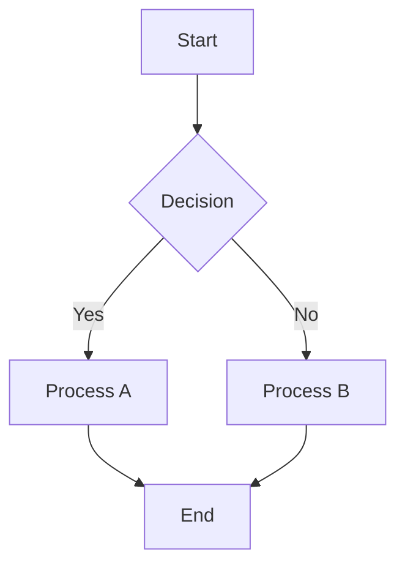
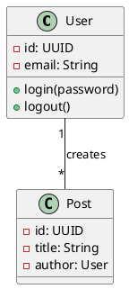
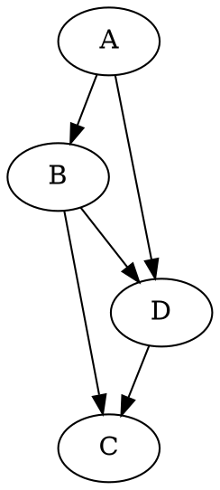
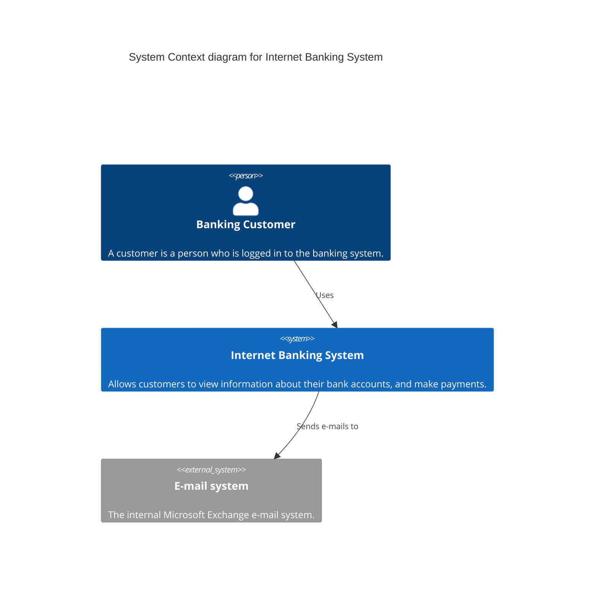
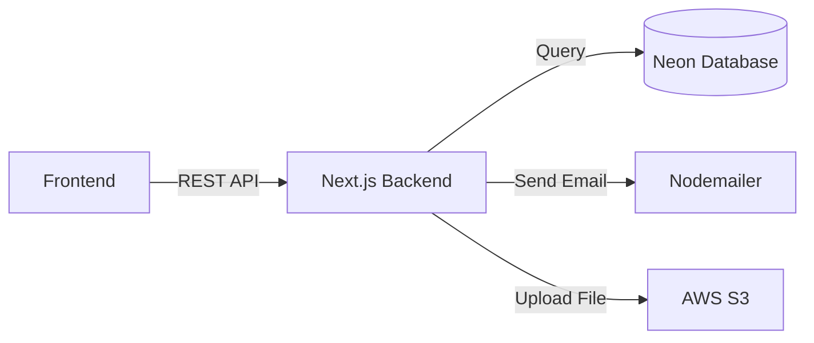
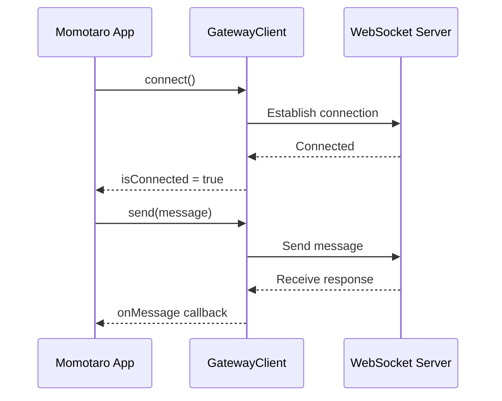
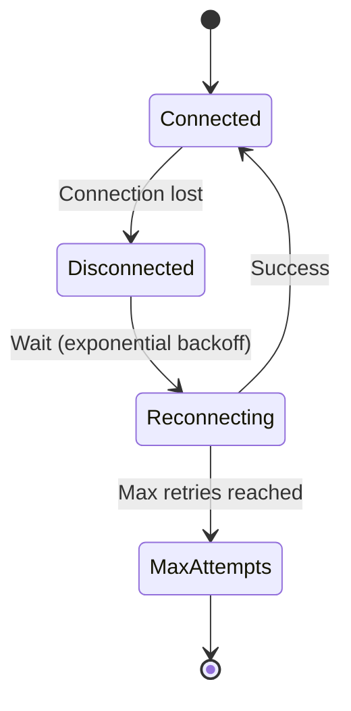
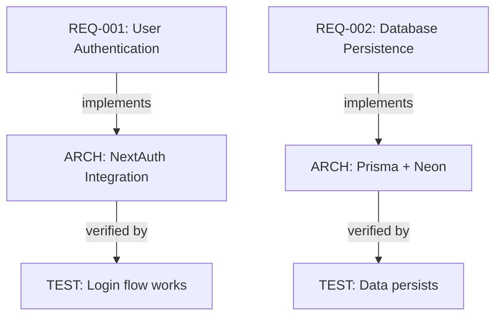

# Diagramming Tools Analysis & Recommendations

**Date:** March 15, 2026  
**Use Cases:** Software development + Project documentation  
**Scope:** Modern, accessible, integration-friendly tools

---

## Executive Summary

**Recommended Tier 1 Stack (Free, Open Source):**

1. **Mermaid.js** — Primary (95% of diagrams)
   - Flowcharts, sequence, state, class, ER, Gantt, pie charts
   - Code-based (Git-friendly)
   - Browser + CLI rendering
   - Works in Markdown, Notion, GitHub, GitLab

2. **PlantUML** — UML Specialist (5% of diagrams)
   - Complex class diagrams, component diagrams
   - Enterprise UML compliance
   - Docker support

3. **Excalidraw** — Sketching & Wireframes
   - Whiteboard-style for brainstorming
   - Real-time collaboration
   - Export to SVG/PNG

**Why This Stack:**
- ✅ 100% free and open source
- ✅ Git-friendly (code-based)
- ✅ No vendor lock-in
- ✅ Embeddable in documentation
- ✅ Works offline
- ✅ CI/CD compatible

---

## Detailed Tool Comparison

### 1. **Mermaid.js** ⭐⭐⭐⭐⭐

**Rating:** 9/10 for software development

**What it is:**
- JavaScript-based diagram language
- Renders to SVG
- Created by Knut Sveidqvist, now widely adopted
- Used by GitHub, GitLab, Notion, Confluence

**Supported Diagrams:**
```
✅ Flowcharts
✅ Sequence Diagrams (interactions)
✅ Class Diagrams (OOP)
✅ State Diagrams
✅ ER Diagrams (databases)
✅ Gantt Charts (project management)
✅ Pie/Bar Charts
✅ Git Graph
✅ C4 Architecture Diagrams (via extension)
```

**Syntax Example:**


**Pros:**
- ✅ Minimal learning curve
- ✅ Perfect for documentation
- ✅ GitHub/GitLab native support
- ✅ Can embed in Markdown
- ✅ CLI tool (mmdc) for CI/CD
- ✅ Active community
- ✅ Works offline
- ✅ Version control friendly

**Cons:**
- ⚠️ Limited styling customization
- ⚠️ Complex enterprise UML needs PlantUML
- ⚠️ Large diagrams can be slow

**Use Cases:**
- ✅ API flow diagrams
- ✅ System architecture
- ✅ Process flows
- ✅ Database schemas
- ✅ Sprint planning
- ✅ Project roadmaps
- ✅ Decision trees

**Installation:**
```bash
# Node.js CLI
npm install -g @mermaid-js/mermaid-cli

# Python wrapper
pip install mermaid-cli

# Use in docs: just write code blocks
```

**Integration:**
- GitHub README.md (native support)
- GitLab Wiki (native support)
- Notion (embed)
- Confluence (plugin)
- Docusaurus/VuePress (native)
- Markdown documentation

**Cost:** FREE

---

### 2. **PlantUML** ⭐⭐⭐⭐

**Rating:** 8/10 for enterprise UML

**What it is:**
- Mature UML diagram generator (15+ years)
- Text-based like Mermaid
- Used by enterprises needing strict UML compliance
- Apache licensed

**Supported Diagrams:**
```
✅ Use Case Diagrams
✅ Class Diagrams (complex)
✅ Sequence Diagrams
✅ State Diagrams
✅ Component Diagrams
✅ Deployment Diagrams
✅ Object Diagrams
✅ Package Diagrams
✅ Timing Diagrams
✅ Entity Relationship
```

**Syntax Example:**


**Pros:**
- ✅ Strict UML compliance
- ✅ Complex class diagrams
- ✅ Enterprise-ready
- ✅ Docker/cloud deployment
- ✅ Extensive styling
- ✅ Better for formal documentation

**Cons:**
- ⚠️ Steeper learning curve
- ⚠️ More verbose syntax
- ⚠️ Slower than Mermaid
- ⚠️ No native GitHub support (need CI/CD)

**Use Cases:**
- ✅ Enterprise architecture
- ✅ Formal requirements
- ✅ Class model documentation
- ✅ Component specifications
- ✅ Deployment diagrams

**Installation:**
```bash
# Docker (recommended)
docker run -d -p 8080:8080 plantuml/plantuml-server

# Java (direct)
java -jar plantuml.jar diagram.puml

# Node.js
npm install -g plantuml
```

**Cost:** FREE (open source)

---

### 3. **Excalidraw** ⭐⭐⭐⭐

**Rating:** 8/10 for ideation & sketches

**What it is:**
- Virtual whiteboard for sketching
- Hand-drawn style aesthetics
- Real-time collaboration
- MIT licensed

**Best For:**
- Brainstorming sessions
- UI/UX wireframes
- System sketches
- Whiteboard discussions
- Quick mockups

**Pros:**
- ✅ Intuitive drag-and-drop
- ✅ Beautiful hand-drawn feel
- ✅ Real-time collaboration
- ✅ Self-hostable
- ✅ Exports to SVG, PNG, JSON
- ✅ Embedded mode for websites
- ✅ No account required (web version)

**Cons:**
- ⚠️ Not for formal UML
- ⚠️ Limited algorithmic layout
- ⚠️ Styling limited
- ⚠️ Better for sketches than diagrams

**Use Cases:**
- ✅ Whiteboard sessions (async)
- ✅ UI mockups
- ✅ Architecture brainstorms
- ✅ Quick sketches in documentation
- ✅ Wireframing

**Self-hosting:**
```bash
docker run -d -p 3000:3000 excalidraw/excalidraw
```

**Cost:** FREE (open source)

---

### 4. **Graphviz** ⭐⭐⭐

**Rating:** 7/10 for graph visualization

**What it is:**
- Graph layout engine (very mature, 30+ years)
- DOT language
- Powers many other tools

**Use Cases:**
- Dependency graphs
- Network diagrams
- Call graphs
- State machines
- Organizational charts

**Syntax Example:**


**Pros:**
- ✅ Powerful layout algorithms
- ✅ Very mature
- ✅ Renders to many formats
- ✅ Foundation for other tools

**Cons:**
- ⚠️ Steeper learning curve
- ⚠️ Less intuitive than Mermaid
- ⚠️ Requires installation

**Installation:**
```bash
# macOS
brew install graphviz

# Linux
apt-get install graphviz

# Node.js wrapper
npm install -g viz.js
```

**Cost:** FREE (open source)

---

### 5. **C4 Model** ⭐⭐⭐⭐

**Rating:** 9/10 for architecture documentation

**What it is:**
- Not a tool, but a notation system
- Context → Container → Component → Code (4 levels)
- Works with Mermaid, PlantUML, or Structurizr

**Why Important:**
- Standardized way to document software architecture
- Non-technical stakeholders understand Context level
- Technical team understands Code level
- Prevents ambiguity

**Tools that support C4:**
- Mermaid (C4 extension)
- PlantUML (C4-PlantUML)
- Structurizr (cloud, $$$)
- draw.io (manual)

**Example (C4 Context - Mermaid):**


**Cost:** Depends on tool (mostly free if using Mermaid)

---

## Recommendation Matrix

| Tool | Flowcharts | UML | Wireframes | Architecture | Cost | Learning |
|------|-----------|-----|-----------|--------------|------|----------|
| **Mermaid** | ⭐⭐⭐⭐⭐ | ⭐⭐⭐ | ⭐⭐ | ⭐⭐⭐⭐ | Free | Easy |
| **PlantUML** | ⭐⭐⭐ | ⭐⭐⭐⭐⭐ | ⭐⭐ | ⭐⭐⭐⭐ | Free | Hard |
| **Excalidraw** | ⭐⭐⭐⭐ | ⭐ | ⭐⭐⭐⭐⭐ | ⭐⭐⭐ | Free | Easy |
| **Graphviz** | ⭐⭐⭐ | ⭐⭐ | ⭐ | ⭐⭐⭐ | Free | Hard |
| **C4 Model** | N/A | ⭐⭐⭐⭐ | N/A | ⭐⭐⭐⭐⭐ | Free | Medium |

---

## Implementation for ReillyDesignStudio + Momotaro

### Recommended Setup

**Phase 1: Immediate (This Week)**
1. Add Mermaid to documentation
2. Create architecture diagrams (C4 Context level)
3. Document system flows

**Phase 2: Enhanced (Next Week)**
1. Add Excalidraw for whiteboarding
2. Create UI wireframes
3. Team collaboration setup

**Phase 3: Enterprise (Optional)**
1. Add PlantUML for formal UML
2. CI/CD automation
3. Diagram generation from code

---

## Installation & Integration Guide

### For ReillyDesignStudio (Next.js Website)

**Install Mermaid:**
```bash
cd ~/.openclaw/workspace/reillydesignstudio
npm install mermaid @mermaid-js/mermaid-cli
```

**Create diagram in markdown:**
```markdown
## System Architecture


```

**Add to documentation page:**
```typescript
// src/components/DiagramRenderer.tsx
import mermaid from 'mermaid';

export function Diagram({ code }: { code: string }) {
  useEffect(() => {
    mermaid.contentLoaderAsync();
  }, []);
  
  return <div className="mermaid">{code}</div>;
}
```

### For Momotaro-iOS

**Create README with diagrams:**
```markdown
# Momotaro-iOS Architecture

## Connection Flow



## Error Recovery


```

### For Project Documentation

**Document Requirements with Traceability:**
```markdown
# Requirements → Architecture → Tests

## ReillyDesignStudio Traceability


```

---

## CLI Tools for CI/CD

### Mermaid CLI (Automated Diagram Generation)

```bash
# Convert markdown with diagrams to HTML
mmdc -i README.md -o README.html

# Generate PNG from .mmd file
mmdc -i architecture.mmd -o architecture.png

# Watch mode
mmdc -w -i *.mmd
```

### GitHub Actions Integration

```yaml
# .github/workflows/diagrams.yml
name: Generate Diagrams

on: [push]

jobs:
  diagrams:
    runs-on: ubuntu-latest
    steps:
      - uses: actions/checkout@v3
      - uses: mermaid-js/mermaid-cli-action@master
        with:
          files: docs/
          output: docs/generated/
```

### Pre-commit Hook

```bash
#!/bin/bash
# .git/hooks/pre-commit

echo "Generating diagrams..."
mmdc -i docs/*.mmd -o docs/generated/

git add docs/generated/
```

---

## Specific Use Cases for Your Projects

### ReillyDesignStudio (Website)

**Diagrams to create:**

1. **System Architecture**
   ```
   - Frontend (React/Next.js)
   - API Layer (Next.js Routes)
   - Database (Neon/Prisma)
   - Email Service (Nodemailer)
   - File Storage (AWS S3)
   - Authentication (NextAuth/Auth0)
   ```

2. **User Flows**
   ```
   - Login/Registration flow
   - Invoice generation flow
   - Contact form submission
   - Admin panel access
   ```

3. **Database Schema**
   ```
   - Users
   - Projects/Portfolio items
   - Invoices
   - Quotes/Leads
   ```

4. **Deployment Pipeline**
   ```
   - Git push
   - Vercel CI/CD
   - Testing
   - Staging
   - Production
   ```

### Momotaro-iOS (App)

**Diagrams to create:**

1. **Architecture**
   ```
   - SwiftUI Views
   - Gateway Client (WebSocket)
   - Message Models
   - State Management
   ```

2. **Connection Flow**
   ```
   - App Launch
   - WebSocket Connect
   - Message Send/Receive
   - Reconnection Logic
   - Error Handling
   ```

3. **State Machine**
   ```
   - Disconnected
   - Connecting
   - Connected
   - Reconnecting
   - Failed
   ```

4. **Class Relationships**
   ```
   - GatewayClient
   - GatewayMessage
   - ViewModels
   - Observable objects
   ```

---

## Hosting Options

### Self-Hosted Diagram Rendering

**Option 1: Mermaid Render Server**
```bash
docker run -d -p 8000:8080 ghcr.io/mermaid-js/mermaid-server
# Access: http://localhost:8000/render?mermaid=<base64-encoded-diagram>
```

**Option 2: PlantUML Server**
```bash
docker run -d -p 8080:8080 plantuml/plantuml-server
# Access: http://localhost:8080/uml/<base64-encoded-diagram>
```

**Option 3: Excalidraw Self-hosted**
```bash
docker run -d -p 3000:3000 excalidraw/excalidraw
# Full collaborative diagram editor
```

---

## Migration Path: From No Diagrams to Full Documentation

### Week 1: Foundation
- [ ] Install Mermaid locally
- [ ] Create 3 architecture diagrams (C4 Context level)
- [ ] Add to README files
- [ ] Test rendering on GitHub

### Week 2: Integration
- [ ] Add Excalidraw for team sketches
- [ ] Create UI wireframes
- [ ] Document user flows
- [ ] CI/CD automation (GitHub Actions)

### Week 3: Enhancement
- [ ] Add PlantUML for formal UML
- [ ] Create database schemas
- [ ] Document all APIs
- [ ] Add to project documentation

### Month 2: Advanced (Optional)
- [ ] Self-host render servers
- [ ] Generate diagrams from code
- [ ] Real-time collaboration
- [ ] Embed in Notion/Confluence

---

## Comparison with Commercial Tools

| Feature | Mermaid | Lucidchart | Draw.io | Visio |
|---------|---------|-----------|---------|-------|
| Cost | FREE | $$ | FREE | $$$ |
| Learning Curve | Easy | Hard | Medium | Hard |
| Code-based | Yes | No | No | No |
| Git-friendly | Yes | No | Yes | No |
| Collaboration | No | Yes | Yes | Yes |
| Self-hosted | Yes | No | Yes | No |
| Open Source | Yes | No | Yes | No |

**Verdict:** Mermaid + Excalidraw covers 95% of needs for software teams. Only pay for commercial tools if you need real-time team collaboration for complex enterprise diagrams.

---

## Resources & Learning

**Official Documentation:**
- Mermaid: https://mermaid.js.org
- PlantUML: https://plantuml.com
- Excalidraw: https://excalidraw.com
- C4 Model: https://c4model.com

**Interactive Playgrounds:**
- Mermaid Live: https://mermaid.live
- PlantUML Online: https://www.plantuml.com/plantuml/uml/
- Excalidraw: https://excalidraw.com

**Best Practices:**
- Keep diagrams in Git (code-based)
- Use C4 Model for architecture
- Version control diagrams with code
- Auto-generate where possible
- Document assumptions

---

## Next Steps

1. **Choose primary tool:** Mermaid (recommended)
2. **Install locally:** `npm install -g @mermaid-js/mermaid-cli`
3. **Create first diagram:** System architecture
4. **Add to GitHub README:** Commit with code
5. **Setup CI/CD:** Auto-generate PNGs
6. **Team training:** Share examples
7. **Iterate:** Add more as needed

---

## Summary

**For ReillyDesignStudio + Momotaro-iOS:**

✅ **Do this immediately:**
- Install Mermaid
- Create C4 architecture diagrams
- Add to README files
- Use in documentation

✅ **Do next week:**
- Add Excalidraw for brainstorming
- Create UI mockups
- Setup CI/CD automation

❌ **Don't do:**
- Buy expensive commercial tools yet
- Overcomplicate with UML initially
- Store diagrams outside Git

**Result:** Professional architecture documentation, Git-friendly, zero cost, enterprise-ready. 🍑

---

**Ready to implement?** I can create starter diagram templates and integrate into your projects immediately.
