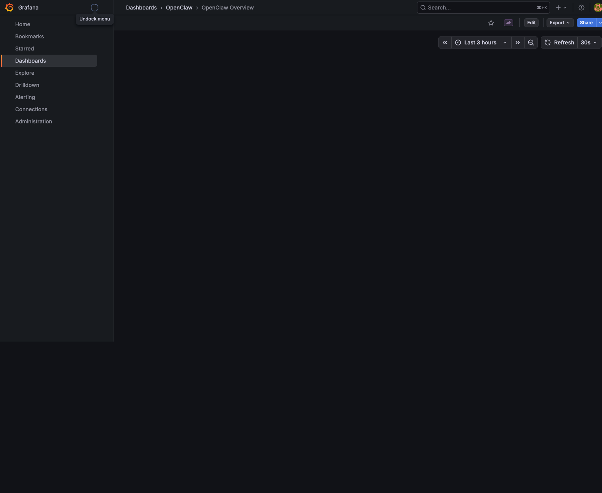
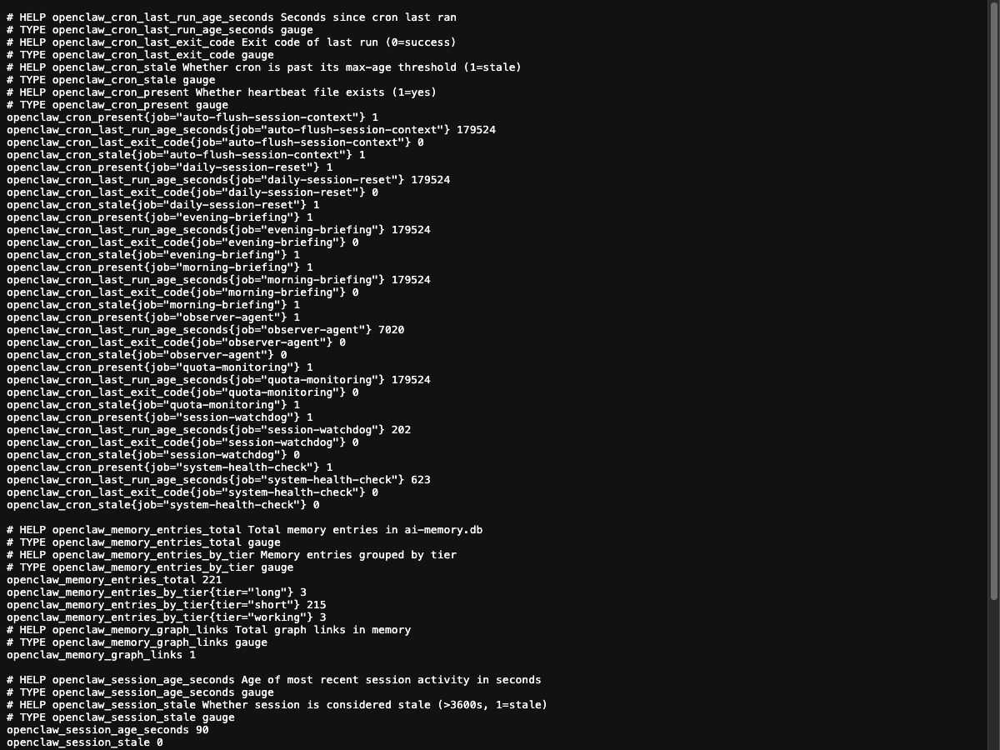

# OpenClaw Observability Stack

Real-time dashboards and alerting for the OpenClaw AI agent system — cron health,
memory, session state, and log errors surfaced through Prometheus + Grafana.

---

## Dashboard



> **Access:** [http://localhost:3000/d/openclaw-overview/openclaw-overview](http://localhost:3000/d/openclaw-overview/openclaw-overview)
> Login: `admin` / `admin`

---

## Theory of Operation

The stack has three layers:

```
┌─────────────────────────────────────────────────────────────────┐
│                        GRAFANA  :3000                           │
│   Dashboard panels poll /metrics every 30s via datasource       │
│   Provisioned automatically from config/grafana/               │
└───────────────────────────┬─────────────────────────────────────┘
                            │ Prometheus scrape (HTTP GET /metrics)
┌───────────────────────────▼─────────────────────────────────────┐
│              METRICS EXPORTER  :9091                            │
│   scripts/openclaw-metrics-exporter.py                          │
│   Pure Python HTTP server — no Prometheus agent required        │
│   Reads live data on every scrape (no buffering)               │
└──────┬─────────────┬──────────────┬────────────┬───────────────┘
       │             │              │            │
  Cron heartbeat   Memory DB    Sessions     Log files
  JSON files       ai-memory.db  sessions.json  *.log
  ~/.openclaw/     workspace/    agents/main/   ~/.openclaw/
  logs/cron-       ai-memory.db  sessions/      logs/
  heartbeats/
```

**Key design decision:** The exporter speaks the Prometheus text format natively —
no `prometheus_client` library needed. Grafana talks to it directly as a Prometheus
datasource, bypassing the need for a full Prometheus server or pushgateway.

---

## System Structure

```
~/.openclaw/workspace/
├── scripts/
│   ├── openclaw-metrics-exporter.py   # Main exporter (305 lines)
│   └── openclaw_metrics_exporter.py   # Import alias (hyphen workaround)
│
├── config/grafana/
│   ├── provisioning/
│   │   ├── datasources/
│   │   │   └── openclaw.yaml          # Prometheus datasource → :9091
│   │   └── dashboards/
│   │       └── openclaw.yaml          # Dashboard file provider config
│   └── dashboards/
│       └── openclaw-overview.json     # 8-panel overview dashboard
│
├── Tests/
│   └── test_grafana_observability.py  # 43-test pytest suite
│
└── docs/
    ├── OBSERVABILITY.md               # This file
    └── screenshots/
        ├── grafana-dashboard.png
        └── metrics-endpoint.png

~/Library/LaunchAgents/
└── ai.openclaw.metrics-exporter.plist  # Auto-start on login, KeepAlive

/opt/homebrew/
└── grafana 12.4.2                      # Managed by: brew services
```

---

## Metrics Reference

The exporter serves Prometheus text format at `http://localhost:9091/metrics`.

### Cron Health

| Metric | Type | Description |
|--------|------|-------------|
| `openclaw_cron_present{job}` | gauge | 1 if heartbeat file exists, 0 if missing |
| `openclaw_cron_last_run_age_seconds{job}` | gauge | Seconds since last successful run |
| `openclaw_cron_last_exit_code{job}` | gauge | Exit code of last run (0 = success) |
| `openclaw_cron_stale{job}` | gauge | 1 if past max-age threshold |

**Tracked cron jobs and their staleness thresholds:**

| Job | Max Age |
|-----|---------|
| `session-watchdog` | 3 hours |
| `auto-flush-session-context` | 4 hours |
| `system-health-check` | 4 hours |
| `observer-agent` | 3 hours |
| `morning-briefing` | 26 hours |
| `evening-briefing` | 26 hours |
| `daily-session-reset` | 26 hours |
| `quota-monitoring` | 26 hours |

### Memory

| Metric | Type | Description |
|--------|------|-------------|
| `openclaw_memory_entries_total` | gauge | Total rows in `ai-memory.db` |
| `openclaw_memory_entries_by_tier{tier}` | gauge | Count by tier: `short`, `long`, `working` |
| `openclaw_memory_graph_links` | gauge | Total edges in memory graph |

### Session

| Metric | Type | Description |
|--------|------|-------------|
| `openclaw_session_age_seconds` | gauge | Seconds since last session activity |
| `openclaw_session_stale` | gauge | 1 if session age > 3600s |

### Log Health

| Metric | Type | Description |
|--------|------|-------------|
| `openclaw_log_errors_recent{log}` | gauge | ERROR/STALE/FAILED lines in last 200 log lines |

Tracked logs: `session_watchdog`, `session_context_flush`, `cron_dead_man`

### System

| Metric | Type | Description |
|--------|------|-------------|
| `openclaw_exporter_scrape_timestamp` | gauge | Unix timestamp of this scrape |
| `openclaw_session_context_age_seconds` | gauge | Age of `SESSION_CONTEXT.md` in seconds |

---

## Live Metrics Example

Raw output from `curl http://localhost:9091/metrics`:

```
# HELP openclaw_cron_present Whether heartbeat file exists (1=yes)
# TYPE openclaw_cron_present gauge
openclaw_cron_present{job="session-watchdog"} 1
openclaw_cron_last_run_age_seconds{job="session-watchdog"} 130
openclaw_cron_last_exit_code{job="session-watchdog"} 0
openclaw_cron_stale{job="session-watchdog"} 0

openclaw_cron_present{job="observer-agent"} 1
openclaw_cron_last_run_age_seconds{job="observer-agent"} 6948
openclaw_cron_last_exit_code{job="observer-agent"} 0
openclaw_cron_stale{job="observer-agent"} 0

# HELP openclaw_memory_entries_total Total memory entries in ai-memory.db
openclaw_memory_entries_total 221
openclaw_memory_entries_by_tier{tier="short"} 215
openclaw_memory_entries_by_tier{tier="long"} 3
openclaw_memory_entries_by_tier{tier="working"} 3
openclaw_memory_graph_links 1

# HELP openclaw_session_age_seconds Age of most recent session activity in seconds
openclaw_session_age_seconds 18
openclaw_session_stale 0

openclaw_exporter_scrape_timestamp 1777046954
openclaw_session_context_age_seconds 1482
```

---

## Metrics Endpoint



---

## Usage

### Check everything is running

```bash
# Exporter health
curl http://localhost:9091/health          # → ok

# Live metrics
curl http://localhost:9091/metrics | grep openclaw_session

# Grafana API health
curl http://localhost:3000/api/health
# → {"database":"ok","version":"12.4.2","commit":"Homebrew"}

# Check datasource is wired
curl -u admin:admin http://localhost:3000/api/datasources | python3 -m json.tool
```

### Run the test suite

```bash
python3 -m pytest Tests/test_grafana_observability.py -v
# 43 tests: collectors, Prometheus format, provisioning YAML,
# dashboard JSON, HTTP integration, Grafana API
```

### Print metrics once (no server)

```bash
python3 scripts/openclaw-metrics-exporter.py --once
```

### Restart the exporter

```bash
launchctl stop ai.openclaw.metrics-exporter
launchctl start ai.openclaw.metrics-exporter
# or to reload plist changes:
launchctl unload ~/Library/LaunchAgents/ai.openclaw.metrics-exporter.plist
launchctl load   ~/Library/LaunchAgents/ai.openclaw.metrics-exporter.plist
```

### Restart Grafana

```bash
brew services restart grafana
brew services list | grep grafana
```

---

## Service Management

Both services are configured for automatic startup:

| Service | Manager | Config | Auto-restart |
|---------|---------|--------|-------------|
| Metrics Exporter | launchd | `~/Library/LaunchAgents/ai.openclaw.metrics-exporter.plist` | Yes (`KeepAlive: true`) |
| Grafana | Homebrew Services | `/opt/homebrew/etc/grafana/grafana.ini` | Yes |

Grafana's provisioning directory is set to:
```
/Users/rreilly/.openclaw/workspace/config/grafana/provisioning
```
Any changes to datasource or dashboard configs take effect on Grafana restart.

---

## Dashboard Panels (8 total)

| Panel | Query | What it shows |
|-------|-------|---------------|
| Session Active | `openclaw_session_stale == 0` | Green/red: is there a live session? |
| Session Age | `openclaw_session_age_seconds` | Seconds since last session activity |
| Cron Health | `openclaw_cron_stale` | Per-job stale flags across all 8 crons |
| Cron Last Run Age | `openclaw_cron_last_run_age_seconds` | Time series of run recency |
| Memory Total | `openclaw_memory_entries_total` | Total entries in ai-memory.db |
| Memory by Tier | `openclaw_memory_entries_by_tier` | short/long/working breakdown |
| Log Errors | `openclaw_log_errors_recent` | Recent error lines per log file |
| Exporter Uptime | `openclaw_exporter_scrape_timestamp` | Last successful scrape timestamp |

---

## Adding New Metrics

1. Add a collector function `_your_metrics() -> list[str]` in `openclaw-metrics-exporter.py`
2. Add it to the `sections` list in `collect_all_metrics()`
3. Add corresponding panels to `config/grafana/dashboards/openclaw-overview.json`
4. Add test coverage in `Tests/test_grafana_observability.py`
5. Restart the exporter: `launchctl stop/start ai.openclaw.metrics-exporter`

Grafana picks up dashboard JSON changes automatically (file provider polls every 10s).

---

*Stack deployed: April 24, 2026 | Grafana 12.4.2 | Python 3.x | macOS launchd*
