# Momotaro-iOS Architecture

## System Overview

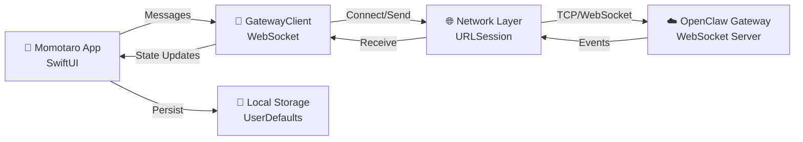

## Connection State Machine

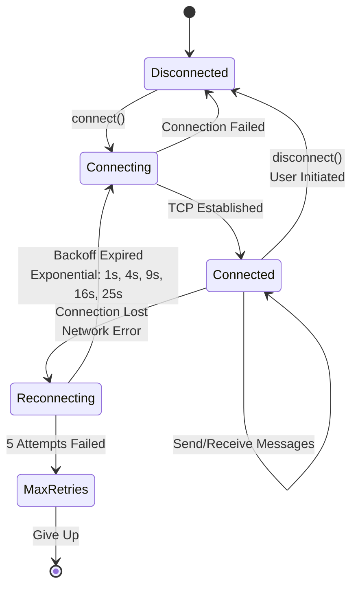

## Message Flow

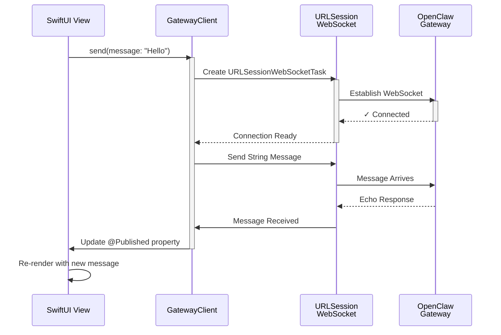

## Error Handling Flow

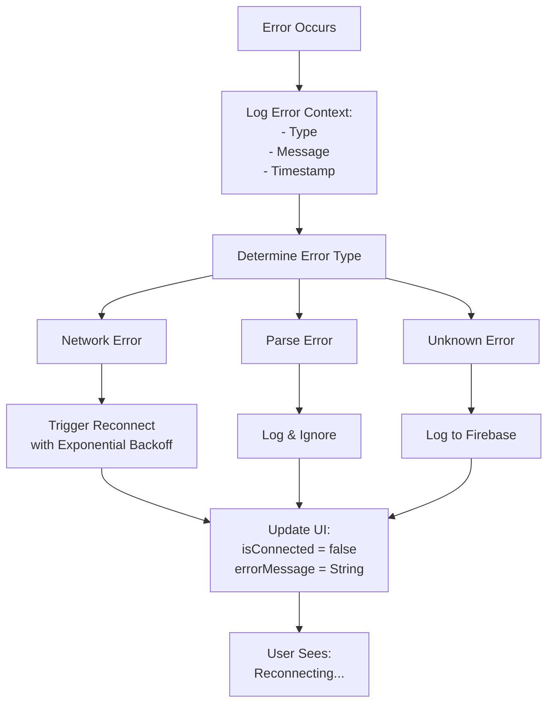

## Class Structure

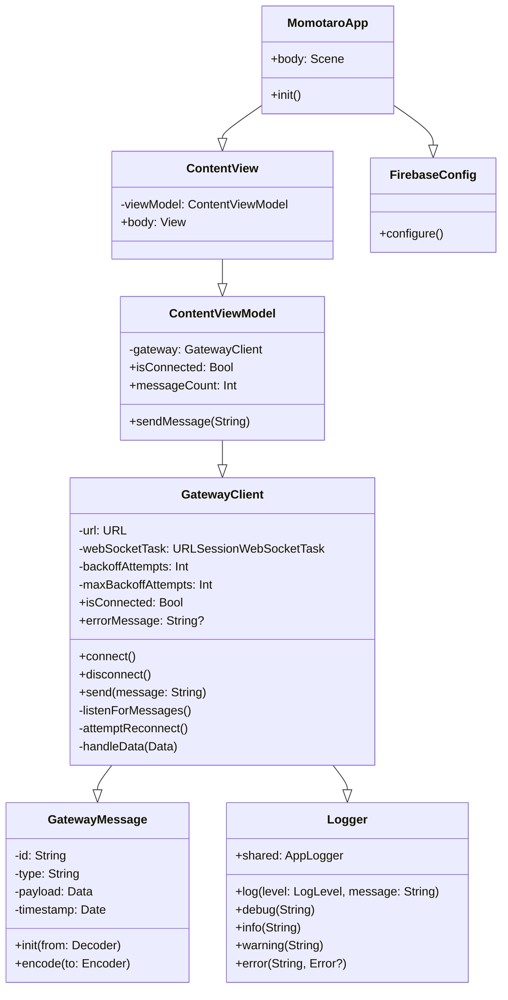

## Logging & Monitoring

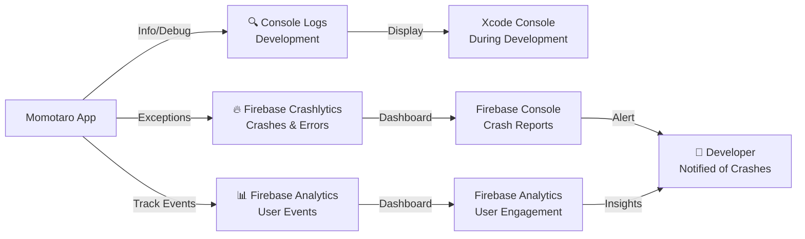

## Data Flow: Message Lifecycle

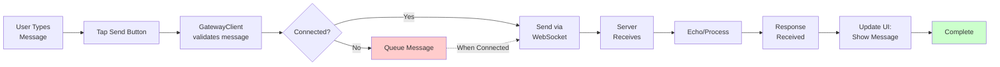

## Network Architecture

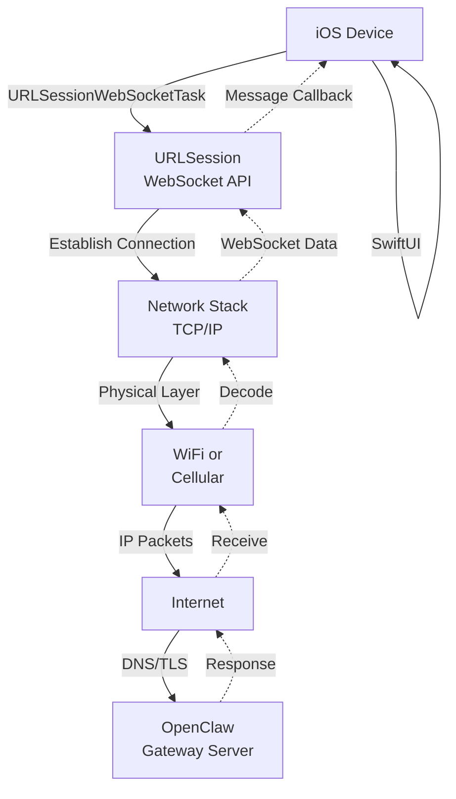

## Reconnection Strategy

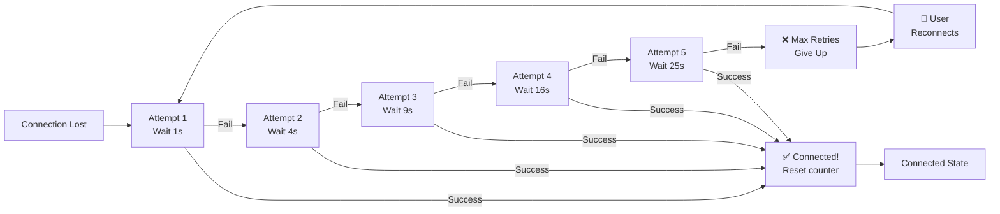

## Performance & Memory Management

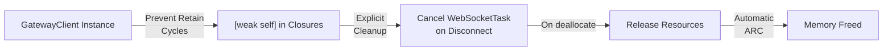

## Deployment & Testing

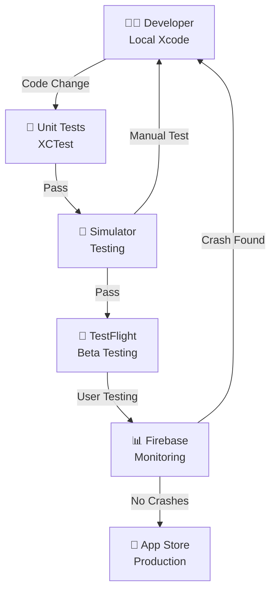

## Technology Stack

**Language & Framework:**
- Swift (iOS 17+)
- SwiftUI (UI Framework)
- Combine (Reactive Programming)

**Networking:**
- URLSession (WebSocket support)
- TCP/IP (Underlying protocol)
- TLS/SSL (Encryption)

**Data:**
- Codable (JSON serialization)
- UserDefaults (Local persistence)

**Logging & Monitoring:**
- os.Logger (Apple unified logging)
- Firebase Crashlytics (Crash reporting)
- Firebase Analytics (Event tracking)

**Development Tools:**
- Xcode 15+
- Swift Package Manager
- XCTest (Unit testing)

---

## Key Decisions

### Why URLSession WebSocket?
- Native iOS API (no external dependencies)
- Full WebSocket support
- Automatic TLS handling
- Battery efficient

### Why SwiftUI + Combine?
- Modern, reactive UI
- Automatic state management
- Less boilerplate than UIKit
- Future-proof

### Why Firebase Crashlytics?
- Automatic crash capture
- Real-time alerts
- No setup needed (just plist)
- Free tier is generous

### Why Exponential Backoff for Reconnection?
- Prevents server overload
- Efficient battery usage
- Standard practice
- Configurable multiplier

---

## Related Documents
- [DEBUGGING_TIER1_DEPLOYED.md](../DEBUGGING_TIER1_DEPLOYED.md) - Monitoring setup
- [DIAGRAMMING_TOOLS_ANALYSIS.md](../DIAGRAMMING_TOOLS_ANALYSIS.md) - More architecture patterns
- [GatewayClient Tests](./Tests/GatewayClientTests.swift) - Unit tests
