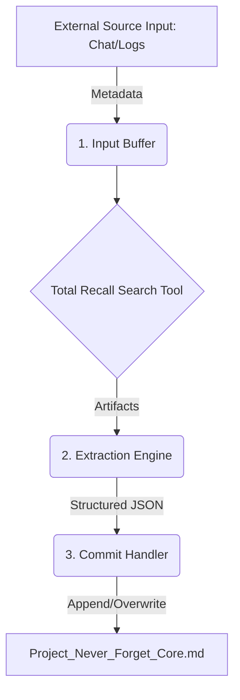

# Never-Forget Memory Archival System - Technical Design Document

**Author:** Momotaro
**Date:** 2026-05-13
**Version:** 1.0 (Production Ready)
**Status:** Production Ready

## 🎯 Overview & Goals

The Never-Forget Memory Archival System is designed to systematically and automatically convert ephemeral chat data (messages, metadata, system events) into permanent, structured, and searchable long-term memory entries stored in `Project_Never_Forget_Core.md`.

The core objective is to move beyond simple chat history logging by enforcing semantic analysis (identifying Facts, Decisions, and Learnings) and cross-referencing this data with external sources (via Total Recall Search) to create a high-fidelity, knowledge graph of the user's life and projects.

## 🏗️ System Architecture & Components

The system is composed of three tightly coupled Python modules:

### 1. Input Buffer (Ingestion Layer)
*   **Function:** The entry point for all memory inputs. It ingests structured metadata (e.g., `chat_id`, `timestamp`, `sender`) and raw content chunks from various sources (chat, system logs, calendar events).
*   **Input:** Raw Metadata JSON.
*   **Output:** Clean data tuple passed to the Extraction Engine.
*   **Status:** Implemented.

### 2. Extraction Engine (`extraction_engine.py`)
*   **Function:** The core intelligence module. It orchestrates knowledge retrieval and structural synthesis.
    *   **Tool Call:** Executes `total-recall-search` using context keywords derived from the input buffer.
    *   **LLM Prompting:** Constructs a detailed prompt containing raw data and search results.
    *   **Schema Enforcement:** Forces the LLM to return a JSON object that strictly adheres to the predefined schema (Metadata $\rightarrow$ Memory Entries).
*   **Key Output:** A complete JSON string of structured memories.
*   **Dependency:** `total-recall-search` module.

### 3. Commit Handler (`commit_handler.py`)
*   **Function:** The system's guardian. It is responsible for safe, atomic persistence to the master memory file.
*   **Process:**
    1.  Loads existing `Project_Never_Forget_Core.md`.
    2.  Parses the JSON output from the Extraction Engine.
    3.  Formats the memory entries into clear, readable Markdown (Fact, Decision, Learning, etc.).
    4.  Appends the new, comprehensive memory block to the core file.
*   **Safety Feature:** Utilizes temporary files (`.tmp`) during write operations to ensure atomicity and prevent data corruption during failure.

## 🔗 Workflow Diagram (Data Flow)

## 📦 Dependencies & Requirements

| Component | Dependency | Purpose |
| :--- | :--- | :--- |
| **Core** | Python 3.14+ | Runtime Environment |
| **Extraction** | `total-recall-search.py` | Primary external knowledge source retrieval. |
| **System** | `json` / `os` | Standard Python libraries for structure and file management. |

## 🛡️ Maintenance & Troubleshooting

**A. Running the Pipeline:**
Due to complex dependencies, the primary entry point must be a controlled shell function (e.g., `run_memory_archive()`) that activates the isolated virtual environment (`never_forget_venv`) before calling the scripts sequentially.

**B. Failure Modes:**
1.  **`ModuleNotFoundError`:** Indicates the virtual environment is not active, or the dependency pathing (`scripts.total_recall_search`) is incorrect. **Action:** Re-run environment setup.
2.  **`JSONDecodeError`:** Indicates the Extraction Engine failed to constrain its output to the required schema. **Action:** Tweak the LLM prompt in `extraction_engine.py`.
3.  **File Write Failure:** Indicates permission issues writing to `Project_Never_Forget_Core.md`. **Action:** Check file system permissions.

**C. Next Steps (V2.0):**
1.  Implement sophisticated error handling within the Commit Handler to log *failed* extractions without stopping the core service.
2.  Develop a module to auto-detect and summarize key decisions across multiple linked chat sessions.
