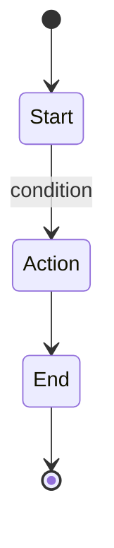

# UML Diagrams — Quick Reference

## Installation
✅ **Already installed:** Mermaid CLI globally

## Generate a Diagram

```bash
# Create diagram.mmd with your syntax
echo 'stateDiagram-v2
    [*] --> State1
    State1 --> State2
' > diagram.mmd

# Generate SVG (default)
mermaid diagram.mmd

# Generate PNG
mermaid diagram.mmd -o diagram.png

# Open in default app
open diagram.svg
```

## Common Commands

```bash
# Quick class diagram
cat > class.mmd << 'EOF'
classDiagram
    class User {
        +name: String
        +email: String
        +authenticate()
    }
EOF
mermaid class.mmd

# Quick state diagram
cat > state.mmd << 'EOF'
stateDiagram-v2
    [*] --> Active
    Active --> Inactive
    Inactive --> [*]
EOF
mermaid state.mmd

# Quick sequence diagram
cat > seq.mmd << 'EOF'
sequenceDiagram
    A ->> B: Hello
    B -->> A: Hi
EOF
mermaid seq.mmd
```

## Examples in This Folder

Ready-to-use examples:
- `clerk-auth-flow.mmd` — Authentication state machine
- `reillydesignstudio-db.mmd` — Database schema
- `momotaro-websocket.mmd` — WebSocket communication flow

Generate them:
```bash
cd ~/.openclaw/workspace/skills/uml-diagrams/examples
mermaid clerk-auth-flow.mmd
mermaid reillydesignstudio-db.mmd
mermaid momotaro-websocket.mmd
```

## All Diagram Types

| Type | Command | Best For |
|------|---------|----------|
| Class | `classDiagram` | OOP structure |
| Sequence | `sequenceDiagram` | Interactions over time |
| State | `stateDiagram-v2` | State machines, workflows |
| ER | `erDiagram` | Database schemas |
| Deployment | `graph TB/LR` | System architecture |
| Flowchart | `graph TB` | Process flows |
| Gantt | `gantt` | Project timelines |
| Pie | `pie` | Statistics |

## Tips

**Readable syntax:**


**Bad syntax:**
```
[*]-->A A-->B B-->[*]
```

**Always:**
- Use spaces around arrows (`-->`, `-->>`)
- End diagram names clearly
- Keep diagram files short (one diagram per file)
- Put diagrams in git for version control

## Formats

```bash
mermaid diagram.mmd              # SVG (default, scalable)
mermaid diagram.mmd -o diagram.png    # PNG (easy to embed)
mermaid diagram.mmd -o diagram.pdf    # PDF (print-friendly)
```

## Copy + Paste Templates

### State Machine
```
stateDiagram-v2
    [*] --> START
    START --> PROCESSING: event
    PROCESSING --> COMPLETE: success
    PROCESSING --> ERROR: failure
    ERROR --> START: retry
    COMPLETE --> [*]
```

### Sequence Flow
```
sequenceDiagram
    participant A
    participant B
    A ->> B: Request
    B -->> A: Response
```

### Database Schema
```
erDiagram
    USER ||--o{ ORDER : places
    ORDER {
        uuid id PK
        uuid user_id FK
        decimal total
    }
    USER {
        uuid id PK
        string email
        string name
    }
```

## Where to Put Diagrams

```
~/.openclaw/workspace/
├── docs/
│   ├── architecture/
│   │   ├── system-overview.mmd
│   │   └── data-flow.mmd
│   └── api/
│       └── oauth-flow.mmd
└── projects/
    ├── reillydesignstudio/
    │   ├── docs/
    │   │   ├── auth.mmd
    │   │   └── database.mmd
    └── momotaro-ios/
        └── architecture.mmd
```

Keep diagrams with their projects + update them when code changes.
