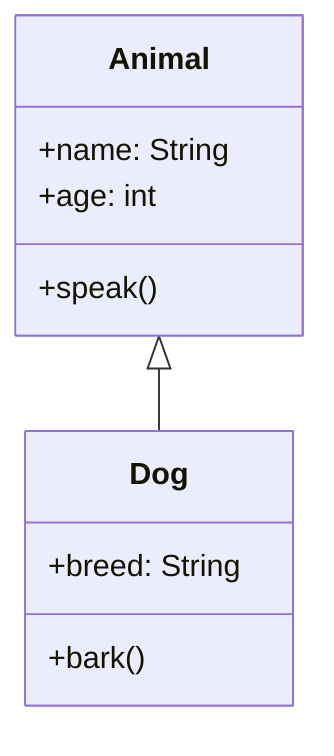
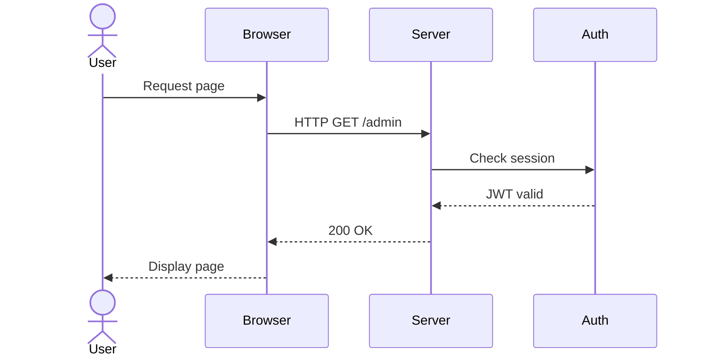
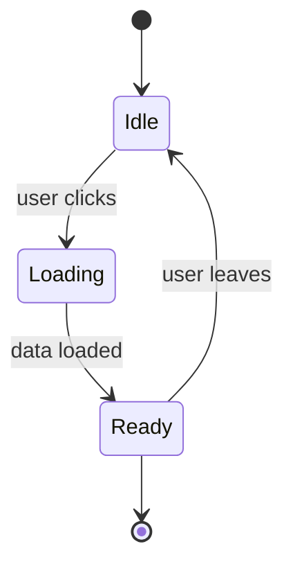
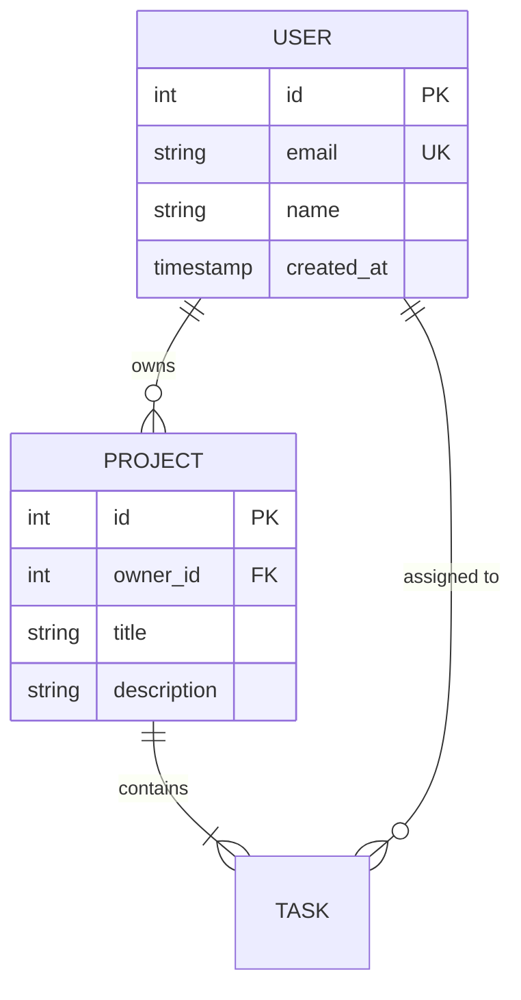
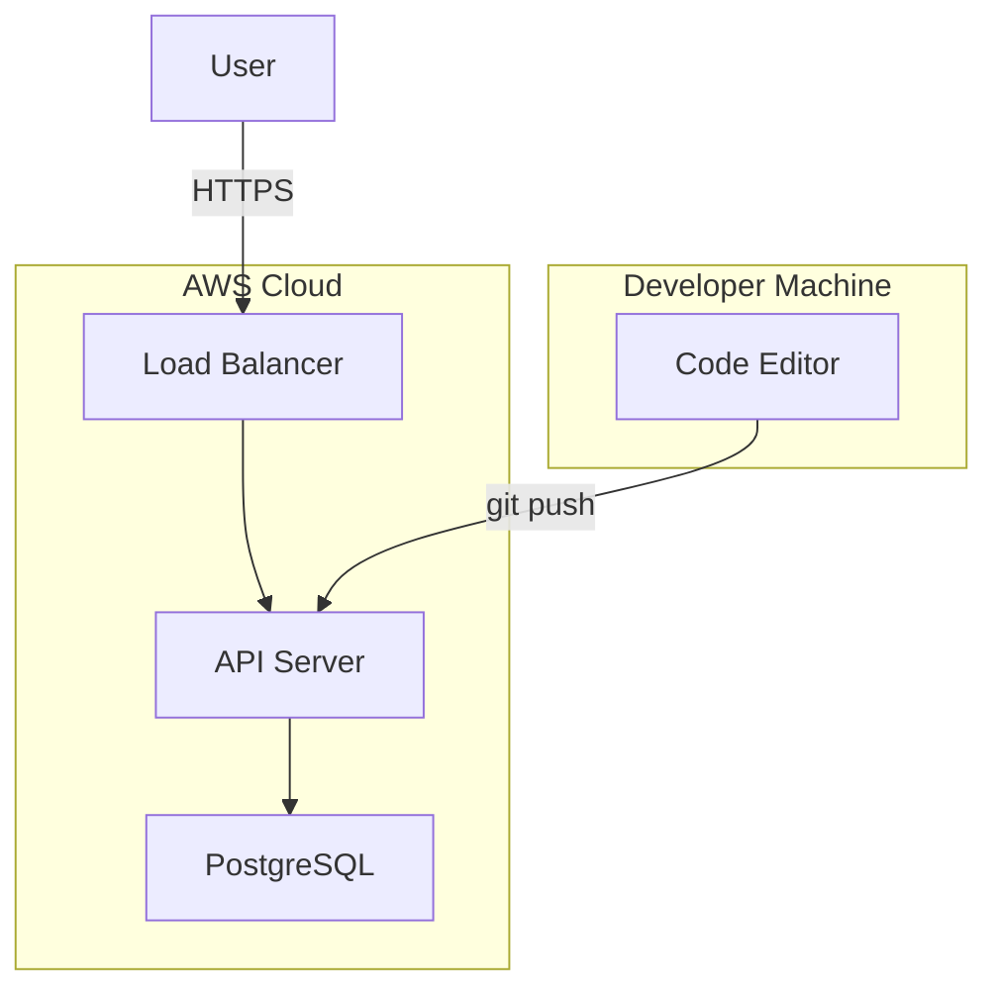

# UML Diagram Generation (Mermaid + PlantUML)

Generate professional UML diagrams using two complementary tools:
- **Mermaid:** Quick, readable syntax for simple to moderate diagrams
- **PlantUML:** Detailed, powerful syntax for complex architectural diagrams

## Quick Start

```bash
# Class diagram
mermaid -i diagram.mmd -o diagram.svg

# View diagram
open diagram.svg
```

## Diagram Types

### 1. Class Diagram



**Use when:** Defining object-oriented structure, relationships, methods

### 2. Sequence Diagram



**Use when:** Showing interactions between components over time

### 3. State Diagram



**Use when:** Modeling state machines, workflows

### 4. Entity-Relationship (ER) Diagram



**Use when:** Planning database schemas

### 5. Deployment Diagram



**Use when:** Showing system architecture and deployment

## Usage Patterns

### Generate from Mermaid file

```bash
# Create diagram.mmd with your diagram syntax
mermaid diagram.mmd

# Or specify output format
mermaid diagram.mmd --output diagram.svg
mermaid diagram.mmd --output diagram.png
```

### Common Examples

**Admin Panel Auth Flow:**
```
stateDiagram-v2
    [*] --> Unauthenticated
    Unauthenticated --> SignIn: user navigates /admin
    SignIn --> Authenticating: submit credentials
    Authenticating --> Authenticated: verify JWT
    Authenticating --> SignIn: invalid credentials
    Authenticated --> [*]
```

**Momotaro iOS WebSocket Connection:**
```
sequenceDiagram
    participant App
    participant Gateway
    participant OpenClaw
    
    App ->> Gateway: Connect (WebSocket)
    activate Gateway
    Gateway ->> OpenClaw: Authenticate
    OpenClaw -->> Gateway: Session token
    Gateway -->> App: Connected
    deactivate Gateway
    
    App ->> Gateway: Send command
    Gateway ->> OpenClaw: Execute
    OpenClaw -->> Gateway: Result
    Gateway -->> App: Receive data
```

**ReillyDesignStudio Data Model:**
```
erDiagram
    CLIENT ||--o{ PROJECT : owns
    PROJECT ||--|{ DELIVERABLE : contains
    DELIVERABLE }o--|| ASSET : uses
    
    CLIENT {
        uuid id PK
        string name
        string email
        timestamp created_at
    }
    
    PROJECT {
        uuid id PK
        uuid client_id FK
        string title
        text description
        enum status
    }
```

## Tips

- **Keep it simple:** Mermaid syntax is readable, but complex diagrams are hard to maintain
- **Use for planning:** Great for pre-development architecture decisions
- **Version control:** Store .mmd files in git alongside code
- **Update with changes:** Keep diagrams in sync with implementation
- **Export formats:** SVG (scalable), PNG (easy to embed), PDF (print-friendly)

## Common Diagram Patterns

| Scenario | Diagram Type |
|----------|-------------|
| API endpoint flow | Sequence |
| Database schema | ER |
| Authentication flow | State |
| System components | Deployment |
| Class hierarchy | Class |

## Examples for Your Projects

### ReillyDesignStudio
- Database schema (ER diagram)
- OAuth flow (Sequence diagram)
- Invoice generation workflow (State diagram)

### Momotaro iOS
- App navigation (State diagram)
- WebSocket communication (Sequence diagram)
- Data models (Class diagram)

### Admin Panel
- Authentication states (State diagram)
- Component hierarchy (Class diagram)
- Page flow (Deployment diagram)
