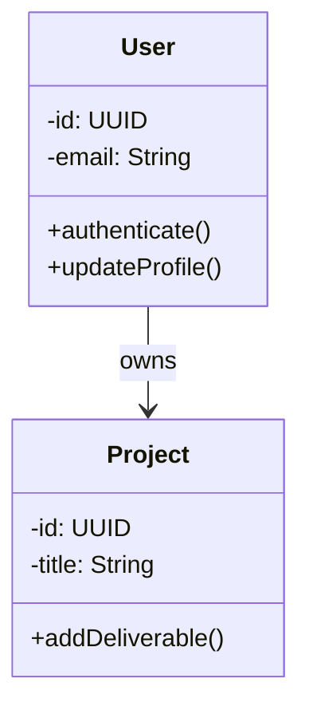
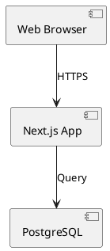

# UML Diagrams — Complete Guide (Mermaid + PlantUML)

## Installation Status

✅ **Mermaid** — Installed globally (`npm install -g mermaid-cli`)
✅ **PlantUML** — Installed via Homebrew (requires Java)
✅ **Graphviz** — Installed (required for PlantUML rendering)
✅ **Unified CLI** — Available at `~/.openclaw/workspace/skills/uml-diagrams/uml`

## Quick Start

### Using the Unified Command

```bash
# Generate from Mermaid file
uml generate state auth.mmd

# Generate from PlantUML file
uml generate component system.puml

# Create new diagram from template
uml new class MyClass
uml new sequence APIFlow

# List all examples
uml list
```

### Direct Usage

**Mermaid:**
```bash
mermaid diagram.mmd              # Generate SVG
mermaid diagram.mmd -o out.png   # Output PNG
```

**PlantUML:**
```bash
plantuml -Tsvg diagram.puml      # Generate SVG
plantuml -Tpng diagram.puml      # Generate PNG
plantuml -Tpdf diagram.puml      # Generate PDF
```

## Choosing Between Mermaid & PlantUML

### Use Mermaid When:
✅ You want **simple, readable syntax**
✅ Diagram is **small to medium** complexity
✅ You need **quick iteration** during planning
✅ Focus is on **logic flows** (state, sequence, flowchart)
✅ You want **minimal dependencies**

**Mermaid Types:** Class, Sequence, State, ER, Deployment, Flowchart, Gantt, Pie

### Use PlantUML When:
✅ You need **detailed, professional** diagrams
✅ Diagram is **large or complex**
✅ You need **advanced styling** options
✅ Focus is on **architecture & design** (component, deployment, timing)
✅ You need **AWS/cloud icons** integration

**PlantUML Types:** Component, Deployment (advanced), Timing, Use Case, Activity, Object, Sequence (advanced), State (advanced), Class (advanced)

## Examples by Project

### ReillyDesignStudio

**Database Schema** (ER Diagram — Mermaid)
```
erDiagram
    USER ||--o{ PROJECT : owns
    PROJECT ||--|{ INVOICE : generates
```

**Authentication Flow** (State Diagram — Mermaid)
```
stateDiagram-v2
    [*] --> SignOut
    SignOut --> Signing: click signin
    Signing --> SignIn: token valid
```

**System Architecture** (Component — PlantUML)
```
component [Vercel] as vercel
component [PostgreSQL] as db
component [Clerk] as clerk

vercel --> db: query
vercel --> clerk: auth
```

### Momotaro iOS

**WebSocket Communication** (Sequence — Mermaid)
```
sequenceDiagram
    App ->> Gateway: connect
    Gateway ->> OpenClaw: authenticate
    OpenClaw -->> Gateway: token
    Gateway -->> App: ready
```

**App Navigation** (State — Mermaid or Activity — PlantUML)

## File Locations

```
~/.openclaw/workspace/
├── skills/uml-diagrams/
│   ├── SKILL.md                 # Main documentation
│   ├── UNIFIED_GUIDE.md         # This file
│   ├── QUICK_START.md           # 30-second reference
│   ├── uml                      # Unified CLI tool
│   ├── examples/
│   │   ├── clerk-auth-flow.mmd
│   │   ├── reillydesignstudio-db.mmd
│   │   ├── momotaro-websocket.mmd
│   │   ├── component-architecture.puml
│   │   ├── use-cases.puml
│   │   └── invoice-workflow.puml
│   └── generate-diagram.sh      # Batch generation

reillydesignstudio/docs/
└── diagrams/
    ├── README.md
    ├── database.mmd
    ├── auth-flow.mmd
    ├── architecture.puml
    ├── use-cases.puml
    └── invoice-workflow.puml
```

## Syntax Reference

### Mermaid Class Diagram



### PlantUML Component Diagram



## Generation Scripts

### Auto-generate all diagrams
```bash
#!/bin/bash
cd ~/project/docs/diagrams

for file in *.mmd; do
  echo "🎨 Mermaid: $file"
  mermaid "$file"
done

for file in *.puml; do
  echo "🎨 PlantUML: $file"
  plantuml -Tsvg "$file"
done

git add *.svg *.png
git commit -m "docs: Update diagrams"
```

### Watch mode (regenerate on change)
```bash
#!/bin/bash
while true; do
  find . -name "*.mmd" -o -name "*.puml" | \
  entr bash -c 'mermaid *.mmd 2>/dev/null; plantuml -Tsvg *.puml 2>/dev/null'
done
```

## Integration with Git

Add to `.gitignore` only if you want to skip SVG/PNG files:
```
# Skip generated diagrams (regenerate on checkout)
docs/diagrams/*.svg
docs/diagrams/*.png
```

Better approach: **Commit both** `.mmd/.puml` AND generated files
```bash
git add docs/diagrams/*.mmd
git add docs/diagrams/*.puml
git add docs/diagrams/*.svg
git commit -m "docs: Update architecture diagrams"
```

## Troubleshooting

### Mermaid issues
```bash
# Check installation
which mermaid

# Reinstall if needed
npm install -g mermaid-cli
```

### PlantUML issues
```bash
# Check installation
which plantuml

# Verify Java is available
java -version

# Reinstall if needed
brew reinstall plantuml
```

### Rendering issues
```bash
# Force text rendering
plantuml -Tsvg -verbose diagram.puml

# Check Graphviz
dot -V
```

## Performance Notes

- **Mermaid:** Instant rendering (<1s)
- **PlantUML:** Slower (5-15s) due to layout computation
- **Large diagrams:** Can take 30+ seconds; consider splitting

## Export Recommendations

| Format | Best For | Command |
|--------|----------|---------|
| SVG | Web, scaling, editing | `mermaid file.mmd` |
| PNG | Embedding, quick view | `mermaid -o file.png file.mmd` |
| PDF | Printing, archiving | `plantuml -Tpdf file.puml` |

## Online Tools

- **Mermaid Live Editor:** https://mermaid.live (try before saving)
- **PlantUML Online:** http://www.plantuml.com/plantuml/uml/ (requires Java)

## Next Steps

1. **Create first diagram:** `uml new class MyProject`
2. **Generate it:** `uml generate class MyProject.mmd`
3. **Add to project:** `mv MyProject.svg ~/project/docs/diagrams/`
4. **Commit:** `git add -A && git commit -m "docs: Add architecture diagrams"`

Diagrams should evolve with your code. Update them when:
- New features added
- Architecture changes
- Data model updates
- API routes modified

**Happy diagramming!** 🎨
